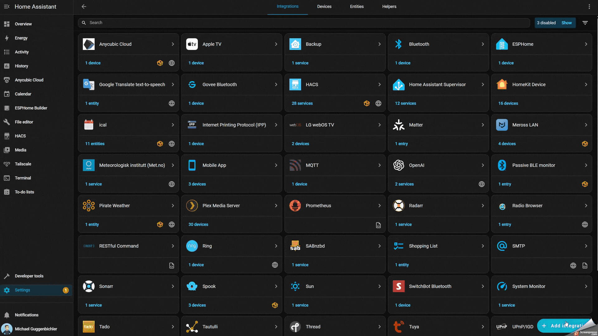

# pCloud Backup for Home Assistant

[![GitHub Release][releases-shield]][releases]
[![License][license-shield]](LICENSE)
[![hacs][hacsbadge]][hacs]
[![Downloads][hacsdownloads-shield]][hacsdownloads]
[![Downloads Total][totaldownloads-shield]][releases]


A native Home Assistant Backup Agent integration for pCloud, enabling users to store, restore, and manage encrypted Home Assistant backups directly in their pCloud account.

## Features

- ✅ **OAuth2 Authentication** - Secure OAuth2 authentication with full 2FA support
- ✅ **Region Support** - Choose between EU or US pCloud datacenters
- ✅ **Automatic Uploads** - Integrates seamlessly with Home Assistant's backup system
- ✅ **Backup Management** - List, download, and delete backups from pCloud directly in Home Assistant
- ✅ **Monitoring Sensors** - Track backup count, last backup time, and sync status
- ✅ **Encrypted Backups** - Uses Home Assistant's built-in backup encryption
- ✅ **Native Backup Agent** - Fully integrated with Home Assistant's backup UI
- ✅ **2FA Compatible** - Works seamlessly with pCloud accounts that have two-factor authentication enabled

## Installation

### HACS (Recommended)

[](https://my.home-assistant.io/redirect/hacs_repository/?owner=ghotso&repository=HAS-pCloud-Backup)

1. Open **HACS** in Home Assistant
2. Go to **Integrations** tab
3. Click **Explore & Download Repositories** (bottom right)
4. Search for **"pCloud Backup"**
5. Click on the integration and then click **Download**
6. **Restart Home Assistant** (required after installation)
7. After restart, go to **Settings** → **Devices & Services**
8. Click **Add Integration** (bottom right)
9. Search for **"pCloud Backup"** and select it

### Manual Installation

1. Download **pcloud_backup.zip** from the [latest release][releases]
2. On your Home Assistant host, create **`config/custom_components/pcloud_backup/`** if it does not exist, then extract **all contents** of the zip into that folder (not into `custom_components/` directly — **`manifest.json`** must end up at **`config/custom_components/pcloud_backup/manifest.json`**).
   ```
   config/custom_components/pcloud_backup/manifest.json
   ```
3. **Restart Home Assistant** (required after installation)
4. After restart, go to **Settings** → **Devices & Services**
5. Click **Add Integration** (bottom right)
6. Search for **"pCloud Backup"** and select it

## Configuration

### Step-by-Step Setup Guide

The integration uses OAuth2 authentication for secure access to your pCloud account. The setup process is straightforward:



#### Step 1: Start the Integration Setup

1. After installation, go to **Settings** → **Devices & Services**
2. Click **Add Integration**
3. Search for **"pCloud Backup"** and select it

#### Step 2: OAuth2 Authentication

1. You'll be redirected to **pCloud's OAuth2 authorization page** in your browser
2. **Log in** to your pCloud account (works with 2FA-enabled accounts)
3. Review the permissions and click **Allow** or **Authorize** to grant access
4. You'll be redirected back to the cloud Home Assistant redirect page
5. If not already entered, enter the address to your Homeassistant installation and click on link account.

#### Step 3: Configure Storage Path & Upload Timeout

1. You'll be prompted for the **pCloud folder path** where backups will be stored
2. Default path: `/HomeAssistant/Backups`
3. You can customize this path (e.g., `/Backups/HomeAssistant` or `/MyBackups`)
4. You'll also set **Upload timeout (seconds)** — this is the maximum wall‑clock time allowed for **one** backup upload over HTTPS (large backups on slow links need a higher value). **Default: 86400 seconds (24 hours).** Allowed range: **600–172800** seconds (10 minutes–48 hours).
5. Click **Submit**

> **Note:** You can change **both** the backup folder path and the **upload timeout (seconds)** at any time under **Settings** → **Devices & services** → **pCloud Backup** → **Configure**. The default timeout remains **86400** seconds unless you change it. When you save, Home Assistant reloads the integration entry automatically so new values apply to the next backup.

#### Step 4: Complete Setup

1. The integration will automatically:
   - Detect your pCloud region (EU or US datacenter)
   - Test the connection to pCloud
   - Register as a backup agent in Home Assistant
2. You'll see a success message confirming the integration is set up
3. The integration is now ready to use!

### What Happens Next?

Once configured, the integration will:
- ✅ Appear in **Settings** → **System** → **Backups** as a backup destination
- ✅ Automatically upload all Home Assistant backups to pCloud
- ✅ Display pCloud backups alongside local backups in the backup manager
- ✅ Provide sensors for monitoring backup status

### Technical Details

**OAuth2 Redirect URI:** The integration uses Home Assistant's OAuth2 redirect system. For Home Assistant Cloud users, the redirect URI is `https://my.home-assistant.io/redirect/oauth`. For local instances, Home Assistant automatically handles the redirect URI.

**Region Detection:** The integration automatically detects whether your pCloud account uses the EU or US datacenter based on the OAuth2 callback response. No manual configuration needed!

**Upload timeout:** The maximum duration (in **seconds**) for a single backup upload is configurable during setup and at any time under the integration’s **Configure** dialog. Default **86400** (24 hours); allowed **600–172800** (10 minutes–48 hours). Raise it if very large backups fail with upload timeouts on a slow uplink.

## Sensors

The integration provides the following sensors:

- `sensor.pcloud_remote_backup_count` - Number of backups stored in pCloud
- `sensor.pcloud_last_remote_backup` - Timestamp of the last successful backup upload
- `sensor.pcloud_last_sync_status` - Status of the last sync operation (OK/Failed)
- `sensor.pcloud_free_space` - Free space available in your pCloud account (account-wide quota)
- `sensor.pcloud_used_space_by_backups` - Storage used by your Home Assistant backups in the pCloud backup folder
- `sensor.pcloud_account_used_space` - Total storage used across your entire pCloud account

## Usage

### Creating Backups

1. Go to **Settings** → **System** → **Backups**
2. Click the **three dots menu** (⋮) in the top right corner
3. Select **Create Backup**
4. The backup will be created locally and automatically uploaded to pCloud

The integration automatically uploads every Home Assistant backup to pCloud.  
Retention, encryption, scheduling and all other logic are entirely handled by the standard Home Assistant backup system—pCloud simply provides the remote storage destination.

### Viewing Backups

All backups (both local and pCloud) are displayed in **Settings** → **System** → **Backups**. Backups stored in pCloud will be automatically shown alongside local backups.

### Restoring a Backup

1. Go to **Settings** → **System** → **Backups**
2. Find the backup you want to restore (local or from pCloud)
3. Click the **three dots menu** next to the backup
4. Select **Restore**

> **Note:** On some Home Assistant installations (particularly Unraid Docker), remote restore directly from pCloud may fail with an error like `OSError: [Errno 39] Directory not empty: '/config/tmp_backups'`. This is due to Home Assistant's behavior on certain platforms. If you encounter this issue, see the [Troubleshooting](#restore-issues) section for a workaround.

## Requirements

- Home Assistant 2025.1 or later
- pCloud account (works with 2FA-enabled accounts)
- Active internet connection for backup synchronization

## Authentication

This integration uses **OAuth2 authentication** as documented in the [pCloud OAuth2 documentation](https://docs.pcloud.com/methods/oauth_2.0/authorize.html).

### Security

OAuth2 provides industry-standard secure authentication:

- **OAuth2 Flow**: Uses the authorization code flow for secure token exchange
- **HTTPS Encryption**: All API communication uses HTTPS (SSL/TLS)
- **Secure Token Storage**: Access tokens are stored securely in Home Assistant's credential store
- **2FA Support**: Fully compatible with pCloud accounts that have two-factor authentication enabled
- **No Password Storage**: Your pCloud password is never stored or transmitted to Home Assistant

The integration follows pCloud's OAuth2 flow and ensures your credentials remain secure.

## Troubleshooting

### Authentication Issues

- **OAuth2 authorization failed**: Make sure you complete the authorization flow in your browser
- **Authentication failed**: Check that your pCloud account is active and accessible
- **Region mismatch**: The integration automatically detects your region, but you can verify it matches your account (EU vs US)
- **Token expired**: If you encounter authentication errors, try removing and re-adding the integration

### Connection Issues

- Verify your pCloud region selection matches your account (EU vs US datacenter)
- Check your internet connection
- Review Home Assistant logs for detailed error messages
- Ensure your pCloud account is active and accessible

### Upload Failures

- Ensure you have sufficient pCloud storage space
- Check network connectivity
- Verify the backup folder path is accessible
- Check Home Assistant logs for specific API error messages

### Restore Issues

#### Remote Restore Fails on Some Installations

On some Home Assistant installations (particularly Unraid Docker), remote restore directly from pCloud may fail with an error like:
```
OSError: [Errno 39] Directory not empty: '/config/tmp_backups'
```

This is a known issue related to Home Assistant's behavior on certain platforms and how it manages temporary backup files during the restore process.

**Workaround:** If you encounter this issue, you can restore backups using the following method:

1. **Download the backup directly from pCloud:**
   - Log in to your pCloud account via web browser
   - Navigate to your backup folder (default: `/HomeAssistant/Backups`)
   - Download the `.tar` backup file to your computer

2. **Upload and restore in Home Assistant:**
   - Go to **Settings** → **System** → **Backups** in Home Assistant
   - Click the **three dots menu** (⋮) in the top right corner
   - Select **Upload Backup**
   - Choose the downloaded `.tar` file from your computer
   - Click **Restore** on the uploaded backup

> ⚠️ **Important:** This workaround requires your **Home Assistant Backup encryption key**. Make sure you have saved your backup encryption key before attempting to restore. Without the correct encryption key, you will not be able to restore the backup.

## Development

This integration follows Home Assistant's integration development guidelines:

- Python 3.11+
- Async/await patterns
- Type hints throughout
- Follows integration quality scale

### Versioning

This project uses [Semantic Versioning](https://semver.org/) with manual release workflow:

- **PATCH** (0.0.1): Bug fixes (`fix:`)
- **MINOR** (0.1.0): New features (`feat:`)
- **MAJOR** (1.0.0): Breaking changes (`feat!:` or `BREAKING CHANGE:`)

Releases are created manually via GitHub Actions workflow dispatch with automatic changelog generation since the last version. See [CONTRIBUTING.md](CONTRIBUTING.md) for commit message guidelines.

## Contributing

Contributions are welcome! Please:

1. Fork the repository
2. Create a feature branch
3. Make your changes
4. Submit a pull request

## License

This project is licensed under the MIT License - see the [LICENSE](LICENSE) file for details.

## Support

- [GitHub Issues](https://github.com/ghotso/HAS-pcloud-Backup/issues)
- [GitHub Discussions](https://github.com/ghotso/HAS-pcloud-Backup/discussions)

## Acknowledgments

- [pCloud](https://www.pcloud.com/) for their cloud storage service
- Home Assistant team for the backup system architecture
- Community contributors

[releases-shield]: https://shields.ghotso.dev/github/v/release/ghotso/HAS-pCloud-Backup?style=for-the-badge
[releases]: https://github.com/ghotso/HAS-pcloud-Backup/releases
[license-shield]: https://shields.ghotso.dev/github/license/ghotso/HAS-pCloud-Backup?style=for-the-badge&color=orange
[hacs]: https://github.com/hacs/integration
[hacsbadge]: https://img.shields.io/badge/HACS-Default-blue?style=for-the-badge
[hacsdownloads-shield]: https://shields.ghotso.dev/github/downloads/ghotso/HAS-pCloud-Backup/latest/pcloud_backup.zip?displayAssetName=false&style=for-the-badge
[hacsdownloads]: https://github.com/ghotso/HAS-pCloud-Backup/releases/latest
[totaldownloads-shield]: https://shields.ghotso.dev/github/downloads/ghotso/HAS-pCloud-Backup/total?style=for-the-badge&label=Downloads%20Total


last updated: 13.11.2025